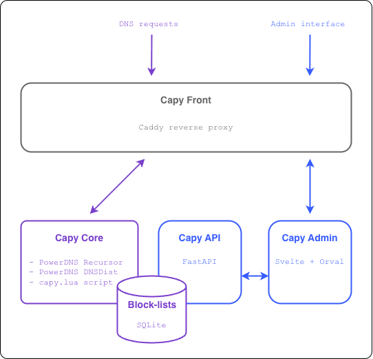
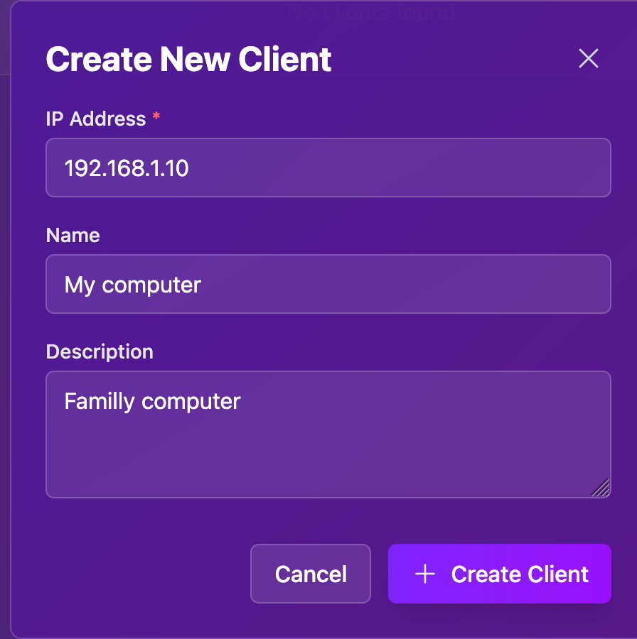
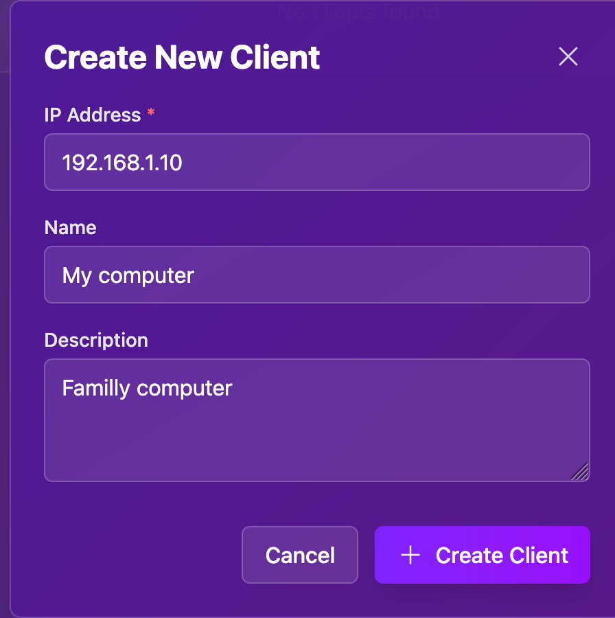
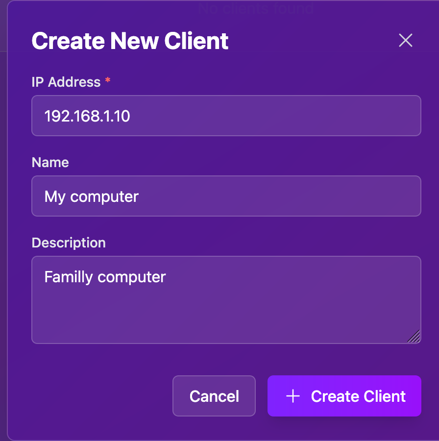

# Capy Privacy DNS

Home DNS filtering platform with

- DNS recursive server for home devices
- DNS-over-HTTPS (DoH) for phones and Web browsers
- Single Page Application web UI + API to manage domains, clients, and blocklists

## Architecture



**Components**

| Component      | Tech stack                           | Role                                                                                |
| -------------- | ------------------------------------ | ----------------------------------------------------------------------------------- |
| **Capy Front** | Caddy                                | Publishes the API, DoH, and admin SPA. TLS termination, routing by host/path.       |
| **Admin SPA**  | Svelte + Orval SPA                   | Web UI at `admin.<domain>`; talks to the API. DoH and DNS at `dns.<domain>`.        |
| **capy_api**   | Python FastAPI                       | REST API (domains, clients, categories, stats). Feeds blocklist/config to the core. |
| **capy_core**  | DnsDist, PowerDNS Recursor, capy.lua | DoH (`/dns-query` on :5300) and DoT (:853). Applies policy and recursion.           |

## Requirements

- A homelab, home-server, NAS or Raspberry-Pi
- Docker and Docker Compose
- TLS certificates: (generated by ./prerequisites.sh)
- Host open ports 80, 443 (front); optionally 53, 853 (core)
- Internet inbound connectivity on those ports (if you want to use it in roaming)

## Quick start (first time)

From the device that will host the services

1. **Get project sources**

```bash
git clone https://github.com/capy-security/capy-privacy.git
```

2. **First-time setup (creates `.env` and certificates)**

```bash
cd capy-privacy
./prerequisites.sh
```

- Choose **1** for local usage only (self-signed certs) or **2** for internet (Let's Encrypt).
- For local: accept default domain `localhost` and IP `127.0.0.1` by pressing Enter, or type your LAN domain/IP.
- The script writes `.env` (including `API_SECRET` for the API) and populates `resources/ssl/{api,dns,admin,ip}/` with the required certificates.

3. **Build and run**

From the repo root (so Docker Compose picks up `.env`):

```bash
docker compose up -d --build
```

From another directory: `docker compose --env-file /path/to/capy-privacy/.env -f /path/to/capy-privacy/docker-compose.yaml up -d --build`.

4. **Create the first admin**



- Open the admin UI (e.g. `https://admin.localhost` for local; accept the self-signed cert in the browser).
- Use the link **"Create admin account (first time only)"** under the sign-in form and create your admin user.
- Then sign in with that account.

5. **Define clients (who gets filtered)**



- **[Home server]** Go to **Clients** and create each device (computer, phone, tablet) that should use the filter.
- **[Cloud / roaming]** Go to **Clients** and add your public IPs so you can use DoH when away from home.

6. **Define categories**


- Go to **Categories** and create the filtering categories you need (e.g. gaming, adult, social, violence). Advertising is pre-defined.

7. **Define groups**



- Go to **Groups**, create groups and assign clients and categories to each group (e.g. "Kids" with strict categories, "Adults" with fewer blocks).

8. **Define blocked domains**


- Go to **Domains** to add blocklists per category. The **Advertising** list can be filled automatically with **Update Ads**; add other domains manually or import as needed.

## Project layout

```
capy-privacy/
├── docker-compose.yaml   # API, core, front
├── prerequisites.sh      # First-time setup: .env (incl. API_SECRET) + SSL (self-signed or Let's Encrypt)
├── api/                  # FastAPI app, SQLite, domain/client/blocklist logic
├── core/                 # dnsdist + PowerDNS Recursor config
├── front/                # Caddy config, static admin SPA, blocked page
├── admin/                # SvelteKit source for the admin UI (built into front image)
└── resources/            # SSL, database, caddy custom config (created by setup)
```

## Contact

Gaël Soudé — capy.security@protonmail.com
