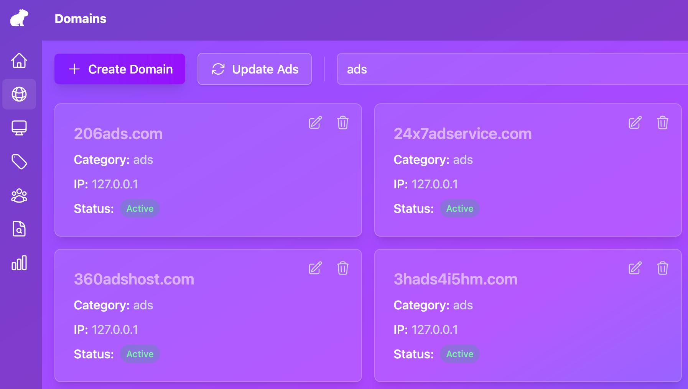
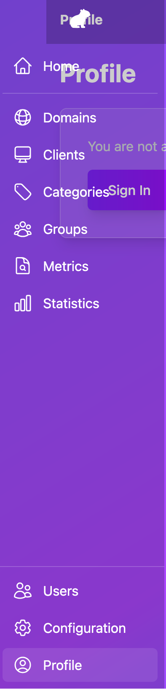

# Capy Privacy DNS

[](https://www.gnu.org/licenses/gpl-3.0)

Home DNS filtering platform with

- DNS recursive server for home devices
- DNS-over-HTTPS (DoH) for phones and Web browsers
- Single Page Application web UI + API to manage domains, clients, and blocklists



## Architecture


**Components**

| Component      | Tech stack                           | Role                                                                                |
| -------------- | ------------------------------------ | ----------------------------------------------------------------------------------- |
| **Capy Front** | Caddy                                | Publishes the API, DoH, and admin SPA. TLS termination, routing by host/path.       |
| **Admin SPA**  | Svelte + Orval SPA                   | Web UI at `admin.<domain>`; talks to the API. DoH and DNS at `dns.<domain>`.        |
| **capy_api**   | Python FastAPI                       | REST API (domains, clients, categories, stats). Feeds blocklist/config to the core. |
| **capy_core**  | DnsDist, PowerDNS Recursor, capy.lua | DoH (`/dns-query` on :5300) and DoT (:853). Applies policy and recursion.           |

## Requirements

- A homelab, home-server, NAS or Raspberry-Pi running Linux
- Docker and Docker Compose
- TLS certificates: (generated by ./prerequisites.sh)
- Host open ports 80, 443 (front); optionally 53, 853 (core)
- Internet inbound connectivity on those ports (if you want to use it in roaming)
- If you want to use from the outside (5G network or other) you will need a DNS domain

## Quick start (first time)

From the device that will host the services

1. **Get project sources**

Clone the capy-privacy repositiry

```bash
git clone https://github.com/capy-security/capy-privacy.git
```

2. **First-time setup**

Launch the prerequisites script. It will create env variables and certificates

```bash
cd capy-privacy
./prerequisites.sh
```

- Choose **1** for local usage only (self-signed certs) or **2** for internet (Let's Encrypt).
- For local: accept default domain `localhost` and IP `127.0.0.1` by pressing Enter, or type your LAN server domain/IP.
- The script writes `.env` (including `API_SECRET` for the API) and populates `resources/ssl/{api,dns,admin,ip}/` with the required certificates.

3. **Build and run**

From the repo root run docker compose:

```bash
docker compose up -d --build
```

4. **Create the first admin**


- Open the admin UI for the first time
  - e.g. `https://admin.localhost` for local; accept the self-signed cert in the browser
  - e.g. `https://your-domain/` if you specified one

- You should see the Admin creation page
- Setup an email and a password and log

5. **How to use**

After logging in, the sidebar gives access to:

- **Domains** — Add, edit or remove domains; assign them to a category and set allow/block.
- **Clients** — Manage DNS clients (devices by IP); link them to groups for filtering policy.
- **Categories** — Define blocklist categories (e.g. ads, malware) and assign domains to them.
- **Groups** — Create groups of clients and attach categories to apply filtering per group.
- **Metrics** — Browse DNS query metrics (domains, clients, blocked/allowed) with filters and search.
- **Statistics** — View aggregated DNS statistics (queries, blocks, trends).
- **Users** — Manage admin and API users (create, edit, delete; roles).
- **Configuration** — System overview: health, database size, network, setup status; clean metrics.
- **Profile** — Your account: display name and password.



## Project layout

```
capy-privacy/
├── docker-compose.yaml   # API, core, front
├── prerequisites.sh      # First-time setup: .env (incl. API_SECRET) + SSL (self-signed or Let's Encrypt)
├── api/                  # FastAPI app, SQLite, domain/client/blocklist logic
├── core/                 # dnsdist + PowerDNS Recursor config
├── front/                # Caddy config, static admin SPA, blocked page
├── admin/                # SvelteKit source for the admin UI (built into front image)
└── resources/            # SSL, database, caddy custom config (created by setup)
```

## License

This project is licensed under the [GNU GPL v3](https://www.gnu.org/licenses/gpl-3.0). See [LICENSE](LICENSE).

## Contact

Gaël Soudé — capy.security@protonmail.com
